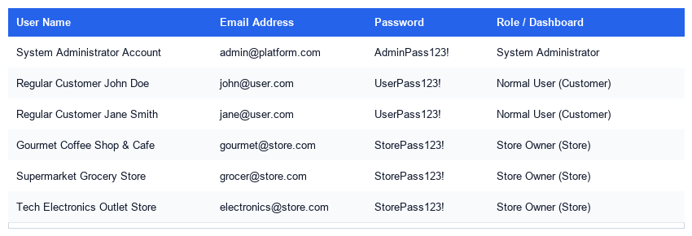

# ShopRater - Store Rating & Review Platform

* 🌐 **Live Link**: [https://store-rating-platform-jade.vercel.app](https://store-rating-platform-jade.vercel.app)

ShopRater is a full-stack web application that allows customers to browse registered local stores, search by name/address, and submit 1-to-5 star reviews. The platform implements a single login system supporting role-based access control (RBAC) across three user groups: System Administrators, Normal Users (Customers), and Store Owners.

---

## 🛠️ Technology Stack

* **Frontend**: React.js (built with Vite for high performance)
  - Styling: Pure modern CSS variables (custom Light Slate theme)
  - Iconography: Lucide React
  - Networking: Axios
* **Backend**: Express.js (Node.js)
  - Sessions/Security: JSON Web Tokens (JWT), Bcrypt password hashing
  - Database Driver: `pg` Pool
* **Database**: PostgreSQL 18
  - Enforces database-level CHECK constraints for names, addresses, and rating limits.

---

## 📂 Project Directory Structure

```text
store-rating-platform/
├── backend/
│   ├── config/db.js          # PostgreSQL pool connection
│   ├── db/
│   │   ├── schema.sql        # Database tables definition
│   │   └── seed.js           # Password hash & mock data seed script
│   ├── middleware/auth.js    # JWT & role permission gates
│   ├── routes/               # Express API endpoints
│   ├── utils/validators.js   # Character length & formatting checks
│   ├── server.js             # Express app mount & main listener
│   └── .env                  # Port & database configuration
├── frontend/
│   ├── public/               # Static assets (store photo)
│   ├── src/
│   │   ├── context/          # Auth Context provider
│   │   ├── pages/            # Login, Admin, User, and Store dashboards
│   │   ├── App.jsx           # Protected role routes
│   │   ├── main.jsx          # App root mount
│   │   └── index.css         # Custom layout stylesheets
│   └── index.html            # Application HTML page
└── README.md                 # Setup and documentation
```

---

## ⚙️ Setup & Installation Guide

Follow these steps to configure the application on your local machine:

### 1. PostgreSQL Database Configuration
1. Make sure your local **PostgreSQL** instance is active (default port is `5432`).
2. Log in to PostgreSQL and create a database named `store_rating_db`:
   ```sql
   CREATE DATABASE store_rating_db;
   ```
3. Set your local database user and password in `backend/.env`.

### 2. Configure Backend Services
1. Open a terminal and navigate to the backend directory:
   ```bash
   cd backend
   ```
2. Install npm packages:
   ```bash
   npm install
   ```
3. Create the database tables and seed test accounts by running:
   ```bash
   npm run seed
   ```
4. Start the Express backend server:
   ```bash
   npm run dev
   ```
   The API will listen on `http://localhost:5000`.

### 3. Configure Frontend Client
1. Open a new terminal and navigate to the frontend directory:
   ```bash
   cd frontend
   ```
2. Install dependencies:
   ```bash
   npm install
   ```
3. Launch the development server:
   ```bash
   npm run dev
   ```
   The website will compile and open on `http://localhost:5173`.

---

## 🔑 Seeded Accounts for Verification

```text
+-------------------------------+-----------------------+----------------+----------------------+
| User Name                     | Email                 | Password       | Role                 |
+-------------------------------+-----------------------+----------------+----------------------+
| System Administrator Account  | admin@platform.com    | AdminPass123!  | System Administrator |
| Regular Customer John Doe     | john@user.com         | UserPass123!   | Normal User          |
| Regular Customer Jane Smith   | jane@user.com         | UserPass123!   | Normal User          |
| Gourmet Coffee Shop & Cafe    | gourmet@store.com     | StorePass123!  | Store Owner          |
| Supermarket Grocery Store     | grocer@store.com      | StorePass123!  | Store Owner          |
| Tech Electronics Outlet Store | electronics@store.com | StorePass123!  | Store Owner          |
+-------------------------------+-----------------------+----------------+----------------------+
```

*(Graphical table card below)*


---

## 📋 Field Validations Enforced
* **Name**: Must be between **20 and 60 characters** (e.g. *Regular Customer John Doe*).
* **Address**: Maximum of **400 characters**.
* **Password**: Must be **8-16 characters**, including at least one **uppercase letter** and one **special character** (e.g. *UserPass123!*).
* **Email**: Valid email structure validation rules.
